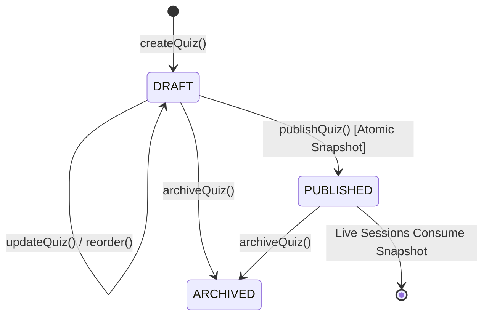

# BAREA-005 Design Gate — Quiz Authoring & Publishing

**Status: DRAFT DESIGN GATE — AWAITING INDEPENDENT REVIEW & GO VERDICT**  
**Milestone:** BAREA-005  
**Dependency:** BAREA-004 completed and merged on `main` (`1faff33`)  
**Implementation Authorization:** NOT AUTHORIZED (Design Gate Only)  

---

## 1. Objective & Canonical Workflow

The objective of **BAREA-005: Quiz Authoring & Publishing** is to design the domain model, persistence schema, server-authoritative security boundaries, and teacher authoring workflow for compiling approved questions from the Question Bank into structured, configured quizzes and creating frozen, immutable published snapshots for future live gameplay sessions.

The platform follows this strict, unalterable progression:

```text
Approved Question Bank (BAREA-002/004)
              ↓
          Quiz Draft
              ↓
  Configure (Timers, Scoring, Shuffle, Order)
              ↓
 Pre-Publish Theological & Completeness Review
              ↓
   Atomic Publication & Validation Gate
              ↓
  Immutable Published Snapshot (for BAREA-007 Live Engine)
```

---

## 2. Scope & Explicit Non-Goals

### In Scope (BAREA-005)
1. Compiling approved questions (`status = 'APPROVED'`) from the organization's Question Bank into structured quizzes.
2. Quiz metadata configuration (title, description).
3. Deterministic question ordering and reordering with sequence validation.
4. Per-quiz default countdown timer (10s to 120s) and optional per-question countdown overrides.
5. Finite scoring-style configuration (`STANDARD`, `SPEED_WEIGHTED`).
6. Option-shuffling configuration toggle (`optionShuffle: boolean`).
7. Pre-publication validation: existence, organization ownership, and re-verification of `APPROVED` status.
8. Atomic publishing: creating an immutable, self-contained published snapshot and transitioning quiz status from `DRAFT` to `PUBLISHED`.
9. Teacher authoring UI screens in Next.js 16 / React 19 conforming to `docs/FRONTEND-STANDARD.md`.

### Explicit Non-Goals (Strict Milestone Boundaries)
To maintain architectural discipline, the following are strictly excluded from BAREA-005 and belong to subsequent milestones:
- **Participant Accounts & Profiles** (open architectural decision per ADR-003).
- **Session & Room Management** (BAREA-006: room codes, QR codes, join links, lobby roster).
- **Real-time Transport & Live WebSockets** (BAREA-007: SSE/WebSocket game state engine).
- **Live Timer & Countdown Execution** (BAREA-007: server ticks, client animations).
- **Participant Answer Submissions & Live Scoring Calculation** (BAREA-007 / BAREA-009).
- **Leaderboards, Standings, & Podiums** (BAREA-010).
- **Big-Screen Projector Synchronized Display** (BAREA-011).
- **Unpublishing or Multi-version branching** (Published quizzes remain frozen; versioning is deferred).

---

## 3. Quiz Domain Model

The Quiz domain entities reside in `src/domain/quiz.ts` and maintain strict boundary separation from transient UI state and raw database rows.

```typescript
export const QuizStatus = Object.freeze({
  DRAFT: 'DRAFT',
  PUBLISHED: 'PUBLISHED',
  ARCHIVED: 'ARCHIVED'
} as const);
export type QuizStatus = (typeof QuizStatus)[keyof typeof QuizStatus];

export const ScoringStyle = Object.freeze({
  STANDARD: 'STANDARD',          // Fixed points per correct answer regardless of speed
  SPEED_WEIGHTED: 'SPEED_WEIGHTED' // Points decay linearly over remaining countdown time
} as const);
export type ScoringStyle = (typeof ScoringStyle)[keyof typeof ScoringStyle];

export interface QuizQuestionItem {
  questionId: string;
  position: number;              // 1-indexed deterministic sequence
  timeLimitSecondsOverride?: number; // Optional override (10 - 120)
}

export interface PublishedQuestionSnapshot {
  questionId: string;
  position: number;
  stem: string;
  type: string;
  options: string[];
  correctOptionIndices: number[];
  explanation: string;
  scriptureReference: string;
  topic: string;
  difficulty: string;
  language: string;
  effectiveTimeLimitSeconds: number; // Evaluated: override ?? defaultTimeLimitSeconds
}

export interface PublishedQuizSnapshot {
  quizId: string;
  organizationId: string;
  title: string;
  description: string;
  scoringStyle: ScoringStyle;
  optionShuffle: boolean;
  defaultTimeLimitSeconds: number;
  questions: PublishedQuestionSnapshot[];
  publishedAt: string;
  publishedByUserId: string;
}

export interface Quiz {
  id: string;
  organizationId: string;
  title: string;
  description: string;
  status: QuizStatus;
  defaultTimeLimitSeconds: number; // Default 30, range [10, 120]
  scoringStyle: ScoringStyle;
  optionShuffle: boolean;          // Default false
  questions: QuizQuestionItem[];   // Ordered list of question items
  publishedSnapshot?: PublishedQuizSnapshot; // Present if status === PUBLISHED
  createdAt: string;
  updatedAt: string;
}
```

---

## 4. Quiz Lifecycle & State Machine



### Lifecycle Rules
1. **DRAFT**:
   - Title, description, timer settings, scoring scheme, and option shuffle may be edited.
   - Questions can be added, removed, or reordered.
   - Question time limit overrides can be configured.
   - Can be soft-deleted to `ARCHIVED`.
2. **PUBLISHED**:
   - **Strict Immutability**: All draft mutation operations (`updateQuiz`, `reorder`, `addQuestion`, `removeQuestion`, `publishQuiz`) are **FORBIDDEN** and fail closed with a descriptive error.
   - The quiz contains an immutable `publishedSnapshot` containing frozen representations of all questions and settings.
   - Future live sessions (BAREA-007+) consume `publishedSnapshot` exclusively.
3. **ARCHIVED**:
   - Soft-deleted state; excluded from standard list views.

---

## 5. Persistence & Schema Design (SQLite `DatabaseSync`)

Following the accepted ADR-006 standard, storage uses Node.js synchronous SQLite (`DatabaseSync` via `SqliteQuizRepository`).

### Relational Schema

```sql
-- 1. Quizzes Table: Core quiz metadata and lifecycle
CREATE TABLE IF NOT EXISTS quizzes (
  id TEXT PRIMARY KEY,
  organization_id TEXT NOT NULL,
  title TEXT NOT NULL,
  description TEXT NOT NULL DEFAULT '',
  status TEXT NOT NULL,
  default_time_limit_seconds INTEGER NOT NULL DEFAULT 30,
  scoring_style TEXT NOT NULL DEFAULT 'STANDARD',
  option_shuffle INTEGER NOT NULL DEFAULT 0,
  created_at TEXT NOT NULL,
  updated_at TEXT NOT NULL
);

CREATE INDEX IF NOT EXISTS idx_quizzes_org ON quizzes (organization_id);
CREATE INDEX IF NOT EXISTS idx_quizzes_org_status ON quizzes (organization_id, status);

-- 2. Quiz Questions Table: Ordered question membership in draft
CREATE TABLE IF NOT EXISTS quiz_questions (
  quiz_id TEXT NOT NULL,
  organization_id TEXT NOT NULL,
  question_id TEXT NOT NULL,
  position INTEGER NOT NULL,
  time_limit_override INTEGER,
  PRIMARY KEY (quiz_id, position),
  UNIQUE (quiz_id, question_id),
  FOREIGN KEY (quiz_id) REFERENCES quizzes(id) ON DELETE CASCADE,
  FOREIGN KEY (question_id) REFERENCES questions(id)
);

CREATE INDEX IF NOT EXISTS idx_quiz_questions_org ON quiz_questions (organization_id);
CREATE INDEX IF NOT EXISTS idx_quiz_questions_qid ON quiz_questions (question_id);

-- 3. Published Quiz Snapshots Table: Frozen, self-contained live payload
CREATE TABLE IF NOT EXISTS published_quiz_snapshots (
  quiz_id TEXT PRIMARY KEY,
  organization_id TEXT NOT NULL,
  snapshot_json TEXT NOT NULL,
  published_at TEXT NOT NULL,
  published_by_user_id TEXT NOT NULL,
  FOREIGN KEY (quiz_id) REFERENCES quizzes(id) ON DELETE CASCADE
);

CREATE INDEX IF NOT EXISTS idx_snapshots_org ON published_quiz_snapshots (organization_id);
```

### Architectural Rationale
- **Normalized Draft State**: `quiz_questions` maintains exact positions and per-question overrides, enforcing unique positions and preventing duplicate questions via primary and unique keys.
- **Dedicated Snapshot Table**: Storing the snapshot as self-contained JSON (`snapshot_json`) in `published_quiz_snapshots` completely isolates live quiz execution from future Question Bank edits, updates, demotions, or deletions. Live rooms need zero dynamic table joins to run.

---

## 6. Security Boundaries & Authorization Model

### A. Zero Browser Trust for Organization Identity
Every Server Action and repository operation derives the organization ID and user identity strictly from `getAuthorizedTeacherContext()` on the server:
- Any `organizationId`, `userId`, `role`, or `tenantId` in client arguments or request bodies is **ignored and discarded**.
- Database queries enforce `organization_id = context.organizationId`.
- Accessing or referencing another tenant's quiz or question returns `Not Found` (preventing tenant enumeration).

### B. Question Selection Security Boundary
When a teacher attaches questions to a quiz draft, the server must re-fetch each question from the Question Bank and verify:
1. **Existence**: The question exists in `questions`.
2. **Tenant Isolation**: `question.organizationId === context.organizationId`. Cross-tenant questions fail closed.
3. **Approval Status**: `question.status === QuestionStatus.APPROVED`. Draft (`DRAFT`), pending (`PENDING_REVIEW`), or archived (`ARCHIVED`) questions cannot be added.
4. **Domain Validity**: The question passes structural domain validation (`options.length >= 2`, valid answer indices).
5. **No Duplicates**: A question cannot be added more than once to the same quiz.

### C. Draft Mutation Allowlisting (BAREA-004 Lesson)
To prevent runtime property injection:
```typescript
export interface UpdateQuizDraftPayload {
  title?: string;
  description?: string;
  defaultTimeLimitSeconds?: number;
  scoringStyle?: ScoringStyle;
  optionShuffle?: boolean;
}
```
In `updateQuizAction()`, the server reconstructs `sanitizedUpdates` strictly by extracting only these allowlisted properties. Any incoming keys for `id`, `organizationId`, `status`, `publishedSnapshot`, `createdAt`, or arbitrary fields are **discarded**.

---

## 7. Timer & Scoring Configuration

### Timer Domain Invariants
- **Default Timer Range**: Integer between **10** and **120** seconds inclusive. Default is **30** seconds.
- **Per-Question Override**: Optional integer between **10** and **120** seconds inclusive. If `null` or `undefined`, the quiz default applies.
- **Validation**: Reject negative numbers, floats, `0`, `NaN`, `Infinity`, strings, or values `< 10` or `> 120`.

### Scoring Scheme Domain Invariants
- `STANDARD`: 100 base points awarded for correct answer regardless of response time (provided answer was submitted before countdown expiry).
- `SPEED_WEIGHTED`: Points decay from 100 down to a minimum floor (e.g. 50 points) based on remaining question time: $\text{Points} = \text{Floor} + (100 - \text{Floor}) \times (\frac{t_{\text{remaining}}}{t_{\text{limit}}})$.
- Unrecognized or arbitrary scoring strings fail closed.

### Option Shuffling
- Boolean flag stored in quiz configuration and snapshot.
- Controls whether the future live engine presents choices in randomized order per participant session.

---

## 8. Atomic Publication & Time-of-Check to Time-of-Use (TOCTOU) Protection

Publication is an explicit, irreversible transition executed in a single atomic database transaction (`db.transaction(...)`).

### Publication Workflow
```text
1. Acquire context via getAuthorizedTeacherContext()
2. Verify quiz exists, belongs to context.organizationId, and status === 'DRAFT'
3. Verify quiz has at least 1 question (minimum composition rule)
4. BEGIN IMMEDIATE TRANSACTION:
   a. Re-fetch all attached questions by question_id from questions table
   b. Verify EVERY question STILL belongs to context.organizationId
   c. Verify EVERY question STILL has status === 'APPROVED' (TOCTOU re-validation)
   d. Construct self-contained PublishedQuizSnapshot object
   e. Insert record into published_quiz_snapshots
   f. Update quizzes SET status = 'PUBLISHED', updated_at = NOW()
5. COMMIT TRANSACTION
6. Revalidate cache path safeRevalidate('/teacher/quizzes')
```

### Why TOCTOU Re-Validation is Critical
A quiz may sit in `DRAFT` for days. During that time:
- An approved question could have been edited in the bank (which ADR-007 automatically demoted to `PENDING_REVIEW`).
- A question could have been soft-deleted (`ARCHIVED`).
- If publication only checked approval at draft creation time, unvetted or deleted questions would be frozen into live quizzes. Re-validating every question at publication guarantees 100% theological and lifecycle integrity.

---

## 9. Immutable Published Snapshot Invariant

Once published, a quiz's snapshot in `published_quiz_snapshots` is **completely decoupled** from the Question Bank:
1. **Bank Edit Independence**: If a teacher modifies Question #1 in the Question Bank (triggering demotion to `PENDING_REVIEW`), the already-published quiz retains Question #1's exact text, options, and scripture reference as captured at publish time.
2. **Bank Deletion Independence**: If Question #1 is archived or deleted from the bank, the published snapshot remains intact and executable.
3. **Session Consistency**: Live games never dynamically join mutable Question Bank rows.

---

## 10. Teacher Authoring UI Architecture (Next.js 16 / React 19)

Conforming to `docs/FRONTEND-STANDARD.md` and ADR-010/ADR-011:

### Route Structure
- `/teacher/quizzes` — Quiz Management & List view.
- `/teacher/quizzes/new` — Create Draft modal or initiation action.
- `/teacher/quizzes/[id]` — Interactive Quiz Workbench (DRAFT) or Read-Only View (PUBLISHED).

### Component Layout
1. **Header Bar**: Displays Quiz Title, Status Badge (`Draft` / `Published`), Authorized Church Name badge, and primary action buttons ("Add Questions", "Review & Publish").
2. **Two-Column Workbench (Desktop/Tablet)**:
   - **Left Column: Question Playlist**:
     - Sequential list of quiz questions with drag handle or up/down ordering buttons.
     - Displays question stem snippet, scripture badge, difficulty badge, and time limit override selector.
     - "Remove from Quiz" button.
   - **Right Column: Configuration & Inspection**:
     - **General Settings**: Title, description text fields.
     - **Pacing & Timing**: Default timer input (10s–120s), option-shuffle toggle switch.
     - **Scoring Scheme**: Radio group or select (`Standard` vs `Speed-Weighted`).
3. **Question Bank Drawer / Modal (`ApprovedQuestionsModal`)**:
   - Searchable, filterable list of the church's `APPROVED` questions.
   - Shows difficulty, topic, Scripture reference.
   - "Add to Quiz" buttons.
4. **Pre-Publish Summary Modal**:
   - Pre-flight checklist: total questions, total estimated quiz run time, difficulty breakdown, Scripture references covered.
   - Clear warning: *"Publishing creates a frozen, immutable snapshot for live games. Changes cannot be made after publishing."*
   - Explicit "Publish Quiz" button.

---

## 11. Required Adversarial Acceptance Tests

The BAREA-005 test suite (`test/quiz-authoring.test.ts`) must implement and pass the following 20 focused adversarial test cases:

### Tenant Isolation
1. **ADV-QZ-01**: Org A teacher cannot read a quiz belonging to Org B (returns 404 / error).
2. **ADV-QZ-02**: Org A teacher cannot edit or mutate a quiz belonging to Org B.
3. **ADV-QZ-03**: Org A teacher cannot attach an Org B question to an Org A quiz (fails closed).
4. **ADV-QZ-04**: Org A teacher cannot publish a quiz belonging to Org B.

### Approval Enforcement & TOCTOU
5. **ADV-QZ-05**: Cannot add a question with status `DRAFT` or `PENDING_REVIEW` to a quiz.
6. **ADV-QZ-06**: Cannot add an `ARCHIVED` question to a quiz.
7. **ADV-QZ-07**: TOCTOU Protection: If a question is modified in the Question Bank (demoted to `PENDING_REVIEW`) while in a quiz draft, attempting to publish the quiz is **REJECTED**.
8. **ADV-QZ-08**: If a question in draft is archived in the bank prior to publish, publishing is **REJECTED**.

### Protected Field Injection & Allowlisting
9. **ADV-QZ-09**: Supplying `status: 'PUBLISHED'` to `updateQuizAction()` is ignored; quiz remains `DRAFT`.
10. **ADV-QZ-10**: Supplying `organizationId: 'victim-org'` to `updateQuizAction()` is ignored; tenant remains unchanged.
11. **ADV-QZ-11**: Supplying arbitrary/unknown runtime properties to `updateQuizAction()` does not persist to database.

### Ordering & Composition Invariants
12. **ADV-QZ-12**: Adding the same question ID twice to a quiz is rejected (no duplicate questions).
13. **ADV-QZ-13**: Reordering with missing or mismatched question IDs fails closed and preserves prior order.
14. **ADV-QZ-14**: Publishing a quiz with 0 questions fails closed (minimum 1 question required).

### Timer & Scoring Validation
15. **ADV-QZ-15**: Default timer `< 10` or `> 120` or non-integer is rejected.
16. **ADV-QZ-16**: Question time limit override `< 10` or `> 120` is rejected.
17. **ADV-QZ-17**: Unrecognized scoring style string is rejected.

### Snapshot Immutability & Atomicity
18. **ADV-QZ-18**: Snapshot Independence: After publishing a quiz, editing the underlying question in the Question Bank leaves the published quiz snapshot **completely unchanged**.
19. **ADV-QZ-19**: Snapshot Independence: Deleting/archiving a question in the bank leaves the published quiz snapshot completely intact.
20. **ADV-QZ-20**: Atomic Publication Rollback: If snapshot generation fails midway, transaction rolls back; quiz remains `DRAFT` and no partial snapshot is stored.

---

## 12. Multi-Agent Review & Independent Findings

| Reviewer Role | Subagent Conversation ID | Key Contributions & Validations |
|---|---|---|
| **Security Architect & Auditor** | `5a538e93-7ebf-4aac-9ad7-048a0e7af494` | Mandated TOCTOU approval re-validation at publish time; specified explicit allowlist for `updateQuizAction`; required row-locking (`FOR UPDATE`) or transaction isolation in SQLite; designed 8 adversarial test vectors. |
| **Frontend Architect** | `57f23589-f514-4623-833c-de160e431a84` | Designed 3-step authoring workflow (`/teacher/quizzes`); defined accessible React Aria primitives (`GridList`, `NumberField`, `Switch`, `Dialog`); established read-only view state for published quizzes. |
| **UI/UX Design Specialist** | Reconciled from BAREA-004 | Enforced church-first dignified aesthetics (no gratuitous gamified SaaS badges, clean high-contrast presentation); pre-publish inspection sheet highlighting Scripture coverage. |

---

## 13. Implementation Readiness Verdict

### **VERDICT: READY FOR INDEPENDENT REVIEW (DESIGN GATE COMPLETE)**

- Application code, database tables, and UI have **NOT** been implemented.
- The design strictly respects all prior ADRs (ADR-001, ADR-002, ADR-004, ADR-006, ADR-007, ADR-010, ADR-011).
- BAREA-005 will proceed to implementation **ONLY** after an independent review records an explicit **GO** decision.
