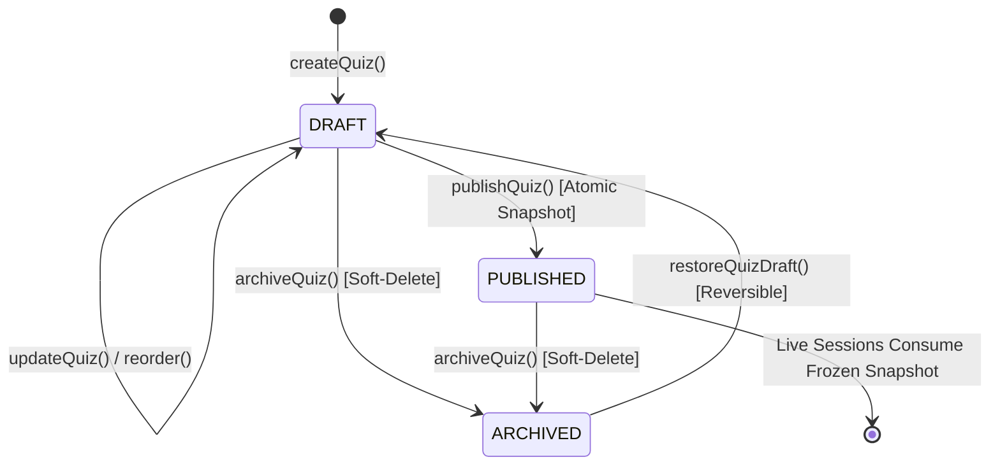

# BAREA-005: Quiz Authoring & Management — System Design & Verification Gate

**Status: DESIGN GATE — REVISED / AWAITING FINAL INDEPENDENT REVIEW**
**Date: 2026-09-09**
**Dependency:** BAREA-004 completed and merged on `main` (`1faff33`)
**Implementation Authorization:** NOT AUTHORIZED (Design Gate Only)

---

## 1. Objective & Canonical Workflow

The objective of **BAREA-005: Quiz Authoring & Publishing** is to design the domain model, persistence schema, server-authoritative security boundaries, and teacher authoring workflow for compiling approved questions from the Question Bank into structured, configured quizzes and creating frozen, immutable published snapshots for future live gameplay sessions.

The platform follows this strict, unalterable progression:

```text
Approved Question Bank (BAREA-002/004)
              ↓
          Quiz Draft
              ↓
  Configure (Timers, Scoring, Shuffle, Order)
              ↓
 Pre-Publish Theological & Completeness Review
              ↓
   Atomic Publication & Validation Gate
              ↓
  Immutable Published Snapshot (for BAREA-007 Live Engine)
```

---

## 2. Scope & Explicit Non-Goals

### In Scope (BAREA-005)
1. Compiling approved questions (`status = 'APPROVED'`) from the organization's Question Bank into structured quizzes.
2. Quiz metadata configuration (title, description).
3. Deterministic question ordering and reordering with sequence validation.
4. Per-quiz default countdown timer (10s to 120s) and optional per-question countdown overrides.
5. Finite scoring-style configuration (`STANDARD`, `SPEED_WEIGHTED` with exact mathematical specifications).
6. Option-shuffling configuration toggle (`optionShuffle: boolean`).
7. Pre-publication validation: existence, organization ownership, and re-verification of `APPROVED` status.
8. Atomic publishing: creating an immutable, self-contained published snapshot, enforcing database and application immutability, and transitioning quiz status from `DRAFT` to `PUBLISHED`.
9. Teacher authoring UI screens in Next.js 16 / React 19 conforming to `docs/FRONTEND-STANDARD.md`.

### Explicit Non-Goals (Strict Milestone Boundaries)
To maintain architectural discipline, the following are strictly excluded from BAREA-005 and belong to subsequent milestones:
- **Participant Accounts & Profiles** (open architectural decision per ADR-003).
- **Session & Room Management** (BAREA-006: room codes, QR codes, join links, lobby roster).
- **Real-time Transport & Live WebSockets** (BAREA-007: SSE/WebSocket game state engine).
- **Live Timer & Countdown Execution** (BAREA-007: server ticks, client animations).
- **Participant Answer Submissions & Live Scoring Calculation** (BAREA-007 / BAREA-009).
- **Leaderboards, Standings, & Podiums** (BAREA-010).
- **Big-Screen Projector Synchronized Display** (BAREA-011).
- **Unpublishing or Multi-version branching** (Published quizzes remain frozen; versioning is deferred).

---

## 3. Quiz Domain Model

The Quiz domain entities reside conceptually in `src/domain/quiz.ts` and maintain strict boundary separation from transient UI state and raw database rows.

```typescript
export const QuizStatus = Object.freeze({
  DRAFT: 'DRAFT',
  PUBLISHED: 'PUBLISHED',
  ARCHIVED: 'ARCHIVED'
} as const);
export type QuizStatus = (typeof QuizStatus)[keyof typeof QuizStatus];

export const ScoringStyle = Object.freeze({
  STANDARD: 'STANDARD',          // Fixed points per correct answer regardless of response speed
  SPEED_WEIGHTED: 'SPEED_WEIGHTED' // Points decay linearly over elapsed response time
} as const);
export type ScoringStyle = (typeof ScoringStyle)[keyof typeof ScoringStyle];

export interface QuizQuestionItem {
  questionId: string;
  position: number;              // 1-indexed deterministic sequence
  timeLimitSecondsOverride?: number; // Optional override (10 - 120)
}

export interface PublishedQuestionSnapshot {
  questionId: string;
  position: number;
  stem: string;
  type: string;
  options: string[];
  correctOptionIndices: number[]; // Server-authoritative data; withheld from active participant view
  explanation: string;
  scriptureReference: string;
  topic: string;
  difficulty: string;
  language: string;
  effectiveTimeLimitSeconds: number; // Evaluated: override ?? defaultTimeLimitSeconds
}

export interface PublishedQuizSnapshot {
  quizId: string;
  organizationId: string;
  title: string;
  description: string;
  scoringStyle: ScoringStyle;
  optionShuffle: boolean;
  defaultTimeLimitSeconds: number;
  questions: PublishedQuestionSnapshot[];
  publishedAt: string;
  publishedByUserId: string;
}

export interface Quiz {
  id: string;
  organizationId: string;
  title: string;
  description: string;
  status: QuizStatus;
  defaultTimeLimitSeconds: number; // Default 30, range [10, 120]
  scoringStyle: ScoringStyle;
  optionShuffle: boolean;          // Default false
  questions: QuizQuestionItem[];   // Ordered list of question items
  publishedSnapshot?: PublishedQuizSnapshot; // Present if status === PUBLISHED
  createdAt: string;
  updatedAt: string;
}
```

---

## 4. Quiz Lifecycle & ARCHIVED Scope (Finding D Resolution)



### Formal Semantics of `ARCHIVED` (Finding D)
1. **Authorization**: Only an authenticated teacher belonging to the quiz's `organizationId` may invoke archive or restore operations.
2. **Draft Archival (`DRAFT -> ARCHIVED`)**:
   - Soft-deletes the draft; hides it from the default active quiz lists.
   - **Reversible**: A teacher can restore an archived draft back to `DRAFT` for continued editing.
3. **Published Archival (`PUBLISHED -> ARCHIVED`)**:
   - Soft-deletes the published quiz from the teacher's active quiz list.
   - **Irreversible**: Cannot be restored to `DRAFT` (preserving snapshot immutability).
   - **Snapshot Preserved**: The record in `published_quiz_snapshots` is **NOT** destroyed.
   - **Prevents New Live Sessions**: Prevents starting new live rooms (BAREA-006) from this quiz.
   - **Zero Live Session Disruption**: Does not interrupt or corrupt ongoing active live rooms (BAREA-007), because live rooms consume the frozen snapshot payload independently.
4. **Legal Operations While `ARCHIVED`**:
   - Reading for historical audit records.
   - Restoring to `DRAFT` (only if the quiz was archived while in `DRAFT` status).
   - All mutations, question additions, reordering, and publishing are strictly **FORBIDDEN**.

---

## 5. Persistence & Schema Design (SQLite `DatabaseSync`)

Following ADR-006, storage uses Node.js synchronous SQLite (`DatabaseSync` via `SqliteQuizRepository`).

### A. Resolution of Finding B: Elimination of Redundant `organization_id`
In `quiz_questions`, `organization_id` is completely removed. Tenant isolation is enforced via the parent `quizzes` table and the referenced `questions` table during query joins. This completely eliminates the denormalization and split-brain risk identified in Finding B.

### Relational Schema

```sql
-- 1. Quizzes Table: Core quiz metadata and lifecycle
CREATE TABLE IF NOT EXISTS quizzes (
  id TEXT PRIMARY KEY,
  organization_id TEXT NOT NULL,
  title TEXT NOT NULL,
  description TEXT NOT NULL DEFAULT '',
  status TEXT NOT NULL,
  default_time_limit_seconds INTEGER NOT NULL DEFAULT 30,
  scoring_style TEXT NOT NULL DEFAULT 'STANDARD',
  option_shuffle INTEGER NOT NULL DEFAULT 0,
  created_at TEXT NOT NULL,
  updated_at TEXT NOT NULL
);

CREATE INDEX IF NOT EXISTS idx_quizzes_org ON quizzes (organization_id);
CREATE INDEX IF NOT EXISTS idx_quizzes_org_status ON quizzes (organization_id, status);

-- 2. Quiz Questions Table: Ordered association table (Normalized, No redundant org_id)
CREATE TABLE IF NOT EXISTS quiz_questions (
  quiz_id TEXT NOT NULL,
  question_id TEXT NOT NULL,
  position INTEGER NOT NULL,
  time_limit_override INTEGER,
  PRIMARY KEY (quiz_id, position),
  UNIQUE (quiz_id, question_id),
  FOREIGN KEY (quiz_id) REFERENCES quizzes(id) ON DELETE CASCADE,
  FOREIGN KEY (question_id) REFERENCES questions(id) ON DELETE RESTRICT
);

CREATE INDEX IF NOT EXISTS idx_quiz_questions_qid ON quiz_questions (question_id);

-- 3. Published Quiz Snapshots Table: Frozen, self-contained live payload
CREATE TABLE IF NOT EXISTS published_quiz_snapshots (
  quiz_id TEXT PRIMARY KEY,
  organization_id TEXT NOT NULL,
  snapshot_json TEXT NOT NULL,
  published_at TEXT NOT NULL,
  published_by_user_id TEXT NOT NULL,
  FOREIGN KEY (quiz_id) REFERENCES quizzes(id) ON DELETE RESTRICT
);

CREATE INDEX IF NOT EXISTS idx_snapshots_org ON published_quiz_snapshots (organization_id);

-- 4. Database-Enforced Immutability Triggers (Finding A Resolution)
CREATE TRIGGER IF NOT EXISTS prevent_snapshot_update
BEFORE UPDATE ON published_quiz_snapshots
BEGIN
  SELECT RAISE(ABORT, 'IMMUTABILITY_VIOLATION: published_quiz_snapshots records are immutable and cannot be updated');
END;

CREATE TRIGGER IF NOT EXISTS prevent_snapshot_delete
BEFORE DELETE ON published_quiz_snapshots
BEGIN
  SELECT RAISE(ABORT, 'IMMUTABILITY_VIOLATION: published_quiz_snapshots records cannot be deleted');
END;
```

---

## 6. True Snapshot Immutability (Finding A Resolution)

The design guarantees snapshot immutability across two independent architectural layers:

1. **Database-Enforced Immutability**:
   - The SQLite engine enforces `prevent_snapshot_update` and `prevent_snapshot_delete` triggers. Any SQL `UPDATE` or `DELETE` statement targeting `published_quiz_snapshots` aborts immediately with an `IMMUTABILITY_VIOLATION` error.
   - `ON DELETE RESTRICT` on the foreign key ensures a published quiz cannot be deleted while its snapshot exists.
2. **Application & Repository-Enforced Immutability**:
   - `PublishedQuizSnapshotRepository` exposes **only** two methods:
     ```typescript
     insertSnapshot(snapshot: PublishedQuizSnapshot): void;
     findSnapshotByQuizId(organizationId: string, quizId: string): PublishedQuizSnapshot | null;
     ```
   - Zero update, delete, replace, or truncate methods exist in the repository or service layers.
   - `publishQuiz()` requires `quiz.status === 'DRAFT'`. If called on an already `PUBLISHED` quiz, it rejects immediately.
   - Published quiz reads (`getQuizByIdAction`) resolve questions directly from the frozen `snapshot_json` payload, bypassing mutable Question Bank tables.

---

## 7. Explicit Snapshot Answer-Secrecy Boundary (Finding E Resolution)

In accordance with **ADR-004** (Server-Authoritative State and Scoring Engine) and **NFR-SEC-001**:

> **Answer-Secrecy Invariant**: Published snapshots are strictly server-authoritative data. `correctOptionIndices` is stored in the snapshot exclusively for the server-authoritative scoring engine and is **NEVER** transmitted to participants during an active answering window.

### Conceptual Projection Pipeline for Live Sessions (BAREA-007+)

```text
[ published_quiz_snapshots.snapshot_json ]
                   ↓ (Server Memory)
        Full Question Entity (with correctOptionIndices)
                   ↓
     [ Answer-Secrecy Projection Filter ]
                   ↓
  ParticipantQuestionProjection (Wire-Safe)
  - stem, type, options, scriptureReference, topic, timeLimit
  - STRICTLY ZERO correctOptionIndices
  - STRICTLY ZERO isCorrect flags
```

- **Active Question State**: Participants receive only the scrubbed `ParticipantQuestionProjection`.
- **Question Result State**: Only after the server records question countdown expiration or the host advances the state machine to `QUESTION_RESULT` does the server transmit the correct option indices and explanation.

---

## 8. Finalized Scoring Semantics (Finding C Resolution)

To ensure BAREA-005 configuration is 100% implementation-ready for BAREA-009 live scoring, all mathematical formulas and boundary conditions are explicitly defined without placeholders:

### Scoring Schemes
1. `STANDARD`:
   - Awarded Points: Fixed **100 points** for any correct answer received before question countdown expiration.
   - Incorrect or late answers: **0 points**.
2. `SPEED_WEIGHTED`:
   - Base Points ($P_{\text{base}}$): **100 points** (maximum points for instantaneous correct answer).
   - Floor Points ($P_{\text{floor}}$): **50 points** (minimum points for correct answer submitted at the last millisecond).
   - Mathematical Formula:
     $$\text{Points} = P_{\text{floor}} + \text{Math.round}\left( (P_{\text{base}} - P_{\text{floor}}) \times \frac{t_{\text{remaining\_ms}}}{t_{\text{limit\_ms}}} \right)$$
   - **Boundary Conditions**:
     - Submitted at $t_{\text{remaining\_ms}} = t_{\text{limit\_ms}}$: $50 + \text{Math.round}(50 \times 1.0) = \mathbf{100\text{ points}}$.
     - Submitted at $t_{\text{remaining\_ms}} = 1\text{ ms}$: $50 + \text{Math.round}(50 \times \frac{1}{t_{\text{limit\_ms}}}) = \mathbf{50\text{ points}}$.
     - Submitted at $t_{\text{remaining\_ms}} \le 0\text{ ms}$ (expired): $\mathbf{0\text{ points}}$.
     - Incorrect answer: $\mathbf{0\text{ points}}$.
     - Rounding: Standard integer rounding via `Math.round()`.

---

## 9. Tightened Concurrency, TOCTOU Protection & Atomic Publication (Finding F Resolution)

### Concurrency Mechanics in SQLite
Node.js synchronous SQLite (`DatabaseSync`) runs against an isolated SQLite database file. Under WAL mode, concurrent readers are supported, but SQLite strictly limits writes to **one writer at a time**.

Using standard `BEGIN` (deferred) risks concurrency deadlocks and dirty reads. Therefore, BAREA-005 mandates:
> **All write and publication operations must explicitly use `BEGIN IMMEDIATE`.**

`BEGIN IMMEDIATE` immediately reserves a write lock on the database file, blocking any other write transaction from beginning until the publication transaction commits or rolls back.

### Publication Execution Sequence
```text
1. Server Action: Resolve authorized context via getAuthorizedTeacherContext()
2. Invoke QuizService.publishQuiz(context.organizationId, quizId, context.userId)
3. Repository: Execute within db.transaction(() => { ... }) [translates to BEGIN IMMEDIATE]:
   a. SELECT * FROM quizzes WHERE id = ? AND organization_id = ?;
      - If not found: THROW Error('Quiz not found');
      - If status !== 'DRAFT': THROW Error('Quiz is not in DRAFT status');
   b. SELECT * FROM quiz_questions WHERE quiz_id = ? ORDER BY position ASC;
      - If empty: THROW Error('Cannot publish quiz with 0 questions');
   c. For each quiz_questions row:
      - SELECT * FROM questions WHERE id = ?;
      - Assert question exists;
      - Assert question.organization_id === context.organizationId;
      - Assert question.status === 'APPROVED' (TOCTOU Re-Validation);
   d. Construct self-contained PublishedQuizSnapshot object (all questions, options, answers, settings);
   e. INSERT INTO published_quiz_snapshots (quiz_id, organization_id, snapshot_json, published_at, published_by_user_id) VALUES (?, ?, ?, ?, ?);
   f. UPDATE quizzes SET status = 'PUBLISHED', updated_at = ? WHERE id = ?;
4. COMMIT TRANSACTION (releases write lock).
5. Safe cache revalidation: safeRevalidate('/teacher/quizzes').
```

### TOCTOU Race Condition Elimination
If Teacher A attempts to publish Quiz $D_1$ while Teacher B concurrently edits Question $Q_1$ in the Question Bank:
- If Teacher B's edit transaction acquires `BEGIN IMMEDIATE` first: $Q_1$ is demoted to `PENDING_REVIEW` (ADR-007). When Teacher A's publish transaction runs, step 3c detects $Q_1$ is `PENDING_REVIEW` and **aborts immediately**.
- If Teacher A's publish transaction acquires `BEGIN IMMEDIATE` first: Teacher A locks the database, verifies $Q_1$ is currently `APPROVED`, writes the snapshot, and commits. Teacher B's subsequent edit demotes the bank row, but the published snapshot is already safely frozen.
- Zero possibility of unapproved or demoted questions entering a published snapshot.

---

## 10. Deterministic Atomic-Publication Failure Injection (Finding G Resolution)

To mathematically prove all-or-nothing rollback without relying on unpredictable disk errors, `SqliteQuizRepository` includes a test seam strictly active when `NODE_ENV === 'test'`:

```typescript
// Test Seam inside SqliteQuizRepository.publishQuiz()
if (process.env.NODE_ENV === 'test' && this.simulateSnapshotFailure) {
  throw new Error('SIMULATED_SNAPSHOT_PERSISTENCE_FAILURE');
}
```

- **Fault Injection Point**: Triggered immediately after step 3e (`INSERT INTO published_quiz_snapshots`) and before step 3f (`UPDATE quizzes SET status = 'PUBLISHED'`).
- **Expected Rollback Outcome**:
  - The SQLite transaction catches the error and executes `ROLLBACK`.
  - Quiz in `quizzes` table remains strictly `status = 'DRAFT'`.
  - Zero rows exist in `published_quiz_snapshots` for this quiz ID (`COUNT = 0`).
  - Proves 100% atomic rollback with zero partial state leakage.

---

## 11. Security Boundaries & Runtime Allowlisting

### Server-Authoritative Tenant Isolation
- Derived strictly from `getAuthorizedTeacherContext()`.
- Client query parameters (`?org=...`), body fields (`organizationId`), or header overrides have **zero authority** and are discarded.

### Runtime Payload Allowlisting (BAREA-004 Lesson)
In `updateQuizAction()`, the server reconstructs `sanitizedUpdates` strictly using an explicit allowlist:
```typescript
export interface UpdateQuizDraftPayload {
  title?: string;
  description?: string;
  defaultTimeLimitSeconds?: number;
  scoringStyle?: ScoringStyle;
  optionShuffle?: boolean;
}
```
Any incoming properties for `id`, `organizationId`, `status`, `publishedSnapshot`, `createdAt`, `updatedAt`, or unknown keys are discarded.

---

## 12. Complete Adversarial Acceptance Test Matrix

The test suite (`test/quiz-authoring.test.ts`) must implement and pass the following 26 focused adversarial test cases:

| Test ID | Category | Scenario & Attack Vector | Expected Invariant Outcome |
|---|---|---|---|
| **ADV-QZ-01** | Tenant Isolation | Org A teacher attempts `getQuizByIdAction(orgBQuizId)` | Fails with 404 / Not Found; zero disclosure. |
| **ADV-QZ-02** | Tenant Isolation | Org A teacher attempts `updateQuizAction(orgBQuizId, { title: "Hacked" })` | Fails with 404 / Not Found; database unmodified. |
| **ADV-QZ-03** | Tenant Isolation | Org A teacher attempts to attach Org B question to Org A quiz | Rejected with error; question not added. |
| **ADV-QZ-04** | Tenant Isolation | Org A teacher attempts `publishQuizAction(orgBQuizId)` | Fails with 404 / Not Found; Org B quiz unmodified. |
| **ADV-QZ-05** | Approval Enforcement | Attempt to add a `DRAFT` question to quiz draft | Rejected; only `APPROVED` questions permitted. |
| **ADV-QZ-06** | Approval Enforcement | Attempt to add a `PENDING_REVIEW` question to quiz draft | Rejected; only `APPROVED` questions permitted. |
| **ADV-QZ-07** | Approval Enforcement | Attempt to add an `ARCHIVED` question to quiz draft | Rejected; only `APPROVED` questions permitted. |
| **ADV-QZ-08** | TOCTOU Protection | Question modified in Question Bank (demoted to `PENDING_REVIEW`) prior to publish | `publishQuizAction` re-validation detects demotion; transaction aborts; quiz remains `DRAFT`. |
| **ADV-QZ-09** | TOCTOU Protection | Question archived in Question Bank prior to publish | `publishQuizAction` re-validation detects archival; transaction aborts; quiz remains `DRAFT`. |
| **ADV-QZ-10** | Protected Field Injection | Client injects `status: 'PUBLISHED'` into `updateQuizAction()` | Allowlist strips property; quiz remains `DRAFT`. |
| **ADV-QZ-11** | Protected Field Injection | Client injects `organizationId: 'victim-org'` into `updateQuizAction()` | Allowlist strips property; tenant authority unchanged. |
| **ADV-QZ-12** | Protected Field Injection | Client injects `id: 'tampered-id'` into `updateQuizAction()` | Allowlist strips property; primary key unchanged. |
| **ADV-QZ-13** | Protected Field Injection | Client passes arbitrary keys `{ evilPayload: '...' }` into `updateQuizAction()` | Allowlist strips unknown keys; not persisted. |
| **ADV-QZ-14** | Composition Invariant | Attempt to add the same question ID twice to a quiz | Rejected by `UNIQUE(quiz_id, question_id)`; no duplicate questions. |
| **ADV-QZ-15** | Ordering Invariant | Reordering with missing or mismatched question IDs | Rejected; prior question sequence preserved. |
| **ADV-QZ-16** | Composition Invariant | Attempt to publish quiz with 0 questions | Rejected; minimum 1 question required. |
| **ADV-QZ-17** | Timer Validation | Default timer `< 10` or `> 120` or float or non-numeric | Rejected by domain validation. |
| **ADV-QZ-18** | Timer Validation | Question timer override `< 10` or `> 120` | Rejected by domain validation. |
| **ADV-QZ-19** | Scoring Validation | Arbitrary or unrecognized scoring style string | Rejected; only `STANDARD` or `SPEED_WEIGHTED` allowed. |
| **ADV-QZ-20** | Snapshot Immutability | Modify question in Question Bank after quiz is published | Published snapshot remains 100% identical and intact. |
| **ADV-QZ-21** | Snapshot Immutability | Archive/delete question in Question Bank after quiz is published | Published snapshot remains 100% identical and executable. |
| **ADV-QZ-22** | Database Immutability | Direct SQL `UPDATE` against `published_quiz_snapshots` | SQLite trigger `prevent_snapshot_update` aborts transaction. |
| **ADV-QZ-23** | Database Immutability | Direct SQL `DELETE` against `published_quiz_snapshots` | SQLite trigger `prevent_snapshot_delete` aborts transaction. |
| **ADV-QZ-24** | Answer Secrecy | Project question for participant during active window | Correct answer indices and explanation are strictly stripped. |
| **ADV-QZ-25** | Concurrency & Race | Concurrent question edit and quiz publish under `BEGIN IMMEDIATE` | Serialized execution; zero unapproved questions enter snapshot. |
| **ADV-QZ-26** | Atomicity Failure Injection | Test seam simulates failure midway through publication | `ROLLBACK` verified; quiz remains `DRAFT`; 0 snapshots created. |

---

## 13. Implementation Readiness Verdict

### **VERDICT: READY FOR FINAL INDEPENDENT REVIEW (DESIGN GATE REVISED)**

- All 7 independent review findings (A through G) are fully resolved.
- Database triggers and repository invariants guarantee true snapshot immutability.
- Redundant `organization_id` is eliminated from `quiz_questions`.
- Scoring formulas, answer-secrecy boundaries, and concurrency semantics are mathematically and operationally specified.
- Application code and migrations have **NOT** been started.
- BAREA-005 will proceed to implementation **ONLY** after an explicit **GO** verdict is issued.
